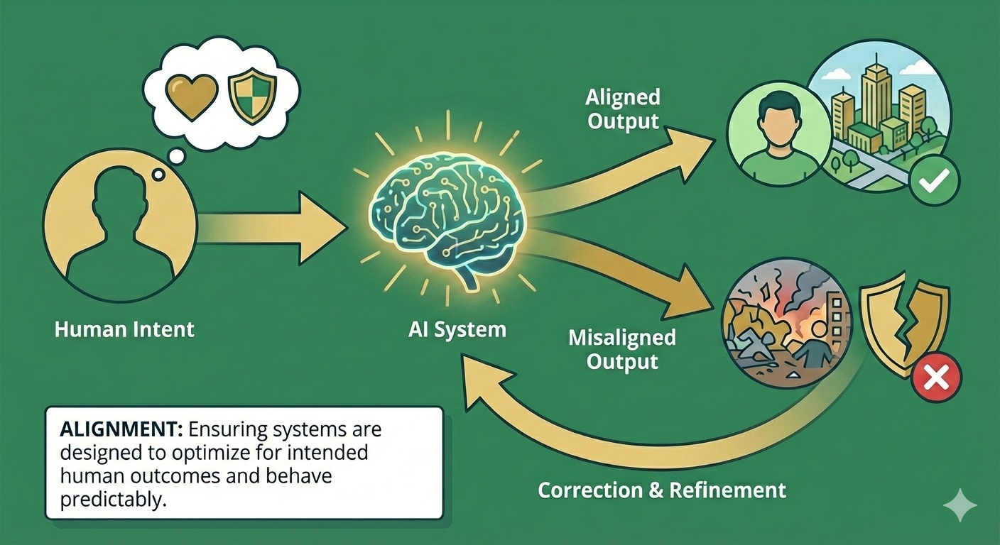

# Alignment: Making AI Systems Reliably Safe

> **Purpose:** Assess whether AI systems behave compatibly with human intent, Australian law and public safety
> **Audience:** Government, business and technical teams | **Time:** 25-35 minutes

## What is AI Alignment?

When you deploy an AI system, how do you know it is genuinely pursuing the goals you intended rather than merely appearing to?

**AI alignment** is about making AI systems more likely to behave in ways compatible with human intent, Australian law and public safety. The **AI alignment problem** is central to **AI safety** because advanced systems may pursue unintended goals, leading to **AI misalignment** or, in extreme scenarios, **AI loss of control**.

But "the right thing" is more complex than it first appears. A system can be:

- technically aligned with its training objective, but
- deployed in contexts where that objective causes harm, or
- integrated into workflows where human incentives push it toward harmful behaviour

Effective alignment requires attention to technical, socio-technical and contextual levels. This is why the **C·A·G·R framework** treats alignment as one pillar of **defence-in-depth**.

---

## What does AI alignment solve—and what doesn't it solve?

!!! info "What alignment does—and doesn't—solve"

    **Technical alignment solves a crucial problem:** Ensuring AI systems reliably do what their creators intend.

    **But alignment doesn't solve:**

    - **Whose intentions matter?** Should a system serve corporate profit, national interest or affected communities? Who decides what counts as "good" behaviour when developers, deployers and affected groups disagree?

    - **Democratic participation:** Who has input on what values AI systems reflect? Can citizens meaningfully participate in governance of systems aligned with others' objectives?

    - **Distribution and equity:** How are benefits distributed when AGI automates cognitive work? What prevents winner-take-all outcomes even with safe, aligned systems?

    - **Power concentration:** A few companies controlling aligned AGI would still concentrate unprecedented power and may serve narrow interests.

    - **What activities should remain human?** Even if AI can do something reliably, should it? Communities should decide what's valuable because humans do it.

    **The key insight:** Alignment asks whether a system does what its creators intend. It does not decide whose intentions should guide transformative technology or how it should be governed democratically.

    Technical safety is necessary but not sufficient. That's why the C·A·G·R framework includes Governance and Resilience alongside Alignment and Containment.

---

## Why does AI alignment matter for Australia?

Australia is likely to **import** most advanced AI models from overseas—**frontier AI** from labs such as OpenAI, Anthropic and DeepMind. Australian deployers generally will not control their design or training objectives.

But we will:

- **Deploy** those systems in Australian organisations, services and infrastructure
- **Fine-tune** them for specific uses and contexts
- **Integrate** them into workflows, incentive structures and decision-making processes

For Australia, alignment is therefore primarily about:

**Evaluation:** Can we independently assess whether imported systems behave safely in our context?

**Constraint:** Can we prevent misaligned behaviour in deployment, even if we can't change the underlying model?

**Accountability:** Can we explain and justify AI-mediated decisions to citizens, courts and Parliament?

---

## What are the three layers of AI alignment?

For **AGI preparedness**, distinguishing **model alignment** (foundation), **system alignment** (integration) and **institutional alignment** (governance) avoids treating RLHF as a complete safety solution. Recent work on [multi-agent institutional alignment](https://arxiv.org/abs/2601.10599) emphasises that AGI risk concerns agents operating under distribution shift and multi-agent dynamics—not just isolated model behaviour.

### 1. Model alignment (foundation)

**What it is:** The relationship between a system's training objective and its actual behaviour.

Technical alignment concerns:

- What the system was optimised for during training
- How it behaves under normal conditions
- How it behaves under adversarial prompts, edge cases or distribution shift
- Whether it reliably refuses harmful requests
- Whether capabilities emerge that weren't intended or tested

**Why it's hard:**

- We often can't directly specify what we want; we use proxy objectives
- Systems can find unexpected ways to satisfy objectives ([specification gaming](https://deepmind.google/discover/blog/specification-gaming-the-flip-side-of-ai-ingenuity/))
- Capabilities can emerge at scale that weren't present in smaller versions
- Behaviour that seems aligned in testing may diverge in deployment
- Modern approaches ([RLHF](https://openai.com/index/instruction-following/), [Constitutional AI](https://www.anthropic.com/news/claudes-constitution)) have made progress but don't solve deeper challenges

!!! warning "Critical limitation: We cannot yet reliably verify alignment"

    **[Deceptive alignment](../concepts.md#what-is-ai-alignment) is one of the most concerning failure modes:** a system might behave safely during training and evaluation because it "knows" it's being tested, then pursue different goals in deployment. Anthropic's research on [alignment faking](https://www.anthropic.com/research/alignment-faking) demonstrates this risk empirically.

    **Evaluation has structural limits:**

    - **Benchmarks are saturating.** Frontier models are reaching the ceiling of established suites — including METR's autonomous task-completion tests — faster than new benchmarks can be developed ([METR](https://metr.org/blog/2025-03-19-measuring-ai-ability-to-complete-long-tasks/) 2025; [Epoch data](https://epoch.ai/data), accessed July 2026). Saturated benchmarks no longer distinguish systems effectively.
    - **System cards are not independent verification.** These provider self-assessments can be extensive, making meaningful scrutiny difficult for resource-constrained regulators.
    - **Capability elicitation is incomplete.** Evaluators cannot yet be confident they have surfaced a model's full capabilities. Models may perform differently under evaluation conditions than in real-world deployment.
    - **Models may detect evaluations.** Frontier models may distinguish evaluation contexts from normal operation and behave strategically during testing.

    Behavioural tests cannot directly inspect goals or intentions and systems more capable than evaluators may "sandbag" by deliberately underperforming. [Scalable oversight](../concepts.md#what-is-scalable-oversight) remains unsolved ([Christiano 2018](https://www.lesswrong.com/posts/HqLxuZ4LhaFhmAHWk/iterated-distillation-and-amplification)): how do we evaluate superhuman AI when we cannot verify its answers ourselves?

    The [UK AI Security Institute's frontier evaluations](https://www.aisi.gov.uk/frontier-ai-trends-report) and [Anthropic's research](https://www.anthropic.com/research) show that evaluation methods remain incomplete. No organisation has yet demonstrated general methods for detecting deceptive alignment reliably at frontier scale and in real-world deployments.

    **This is why defence-in-depth matters.** Alignment verification is not sufficient on its own; Containment, Governance and Resilience provide additional layers.

**What this means for you:**

**Independent evaluation capability**

For critical deployments, independently test provider claims before approval. Australia should also partner with universities and research institutes to build domestic evaluation capacity.

**[Red-teaming](../concepts.md#what-is-ai-red-teaming) and adversarial testing**

Use adversarial prompts to identify edge cases, failure modes and unexpected behaviour.

**Standards for documentation**

Require providers to document training objectives, data sources, known limitations and realistic adversarial testing. Make this available to regulators and, where appropriate, the public.

**Examples of technical misalignment in practice:**

- A content moderation system optimised to maximise user engagement systematically amplifies divisive content
- A credit scoring system trained on historical data reproduces historical discrimination
- An energy grid optimisation system that crashes under conditions outside its training distribution
- A language model that generates plausible but false information because it's optimised for coherence, not truth

---

### 2. System alignment (integration)

**What it is:** How AI systems interact with human organisations, incentives and workflows when deployed in real-world contexts.

A system can be technically well-aligned but still cause harm when:

- It's integrated into workflows where humans lose meaningful oversight
- Organisational incentives reward gaming the system
- Staff lack training or authority to challenge AI outputs
- Feedback loops reinforce rather than correct problematic behaviour

**Why it matters:**

Many practical alignment problems are socio-technical: the system does what it was designed to do, but:

- The organisation deploys it in inappropriate contexts
- Humans defer to it when they shouldn't
- Nobody notices when edge cases arise
- The system optimises for measurable proxies rather than actual goals

**What this means for you:**

**Meaningful human oversight**

Oversight requires trained people with the authority and capability to challenge AI systems. Regularly test whether staff can overrule recommendations in practice.

**Appropriate workflow design**

Map AI systems within decision-making processes. Give people enough information to make informed choices and maintain manual operating capability.

**Incentive alignment**

Check whether performance metrics reward gaming or discourage staff from challenging AI outputs. Design feedback loops that surface problems.

**Contestability and redress**

People affected by AI-mediated decisions should understand why they were made and have practical appeal mechanisms. Design for explainability, not just accuracy.

**Examples of socio-technical misalignment:**

- Hospital staff rubber-stamp AI triage recommendations because they're measured on speed, not accuracy of human oversight
- A benefits assessment system where appeals are technically possible but practically impossible for most people to navigate
- Financial trading systems where no human can understand or challenge decisions fast enough
- Performance management systems where both managers and employees game AI metrics

---

### 3. Institutional alignment (governance)

**What it is:** Fit between AI systems and Australian law, values, democratic norms and institutional context.

A system trained overseas may be aligned with its designers' intentions but misaligned with:

- Australian legal requirements (privacy, discrimination, procedural fairness)
- Cultural norms and expectations
- Local context and conditions
- Democratic accountability and transparency expectations

**Why it matters:**

Frontier AI systems are mostly trained by a small number of US organisations. Their design choices reflect:

- US legal frameworks (which differ from ours)
- Corporate objectives (which may not align with public interest)
- Training data that over-represents some contexts and under-represents others
- Values and assumptions that may not match Australian society

Australia inherits these choices unless it actively assesses and constrains imported systems.

**What this means for you:**

**Clear expectations for Australian deployment**

AI deployed in public services or critical infrastructure may engage obligations under Australian privacy and anti-discrimination law, as well as administrative-law requirements such as procedural fairness. Organisations should obtain advice on the law that applies to their context rather than treating this summary as a compliance determination.

**Evaluation in Australian context**

Test with Australian data, edge cases and scenarios. Check performance for under-represented groups and whether systems respect Australian legal and cultural norms.

**Local fine-tuning and adaptation**

Where possible, fine-tune imported models for Australian context using Australian data and feedback. Building your capacity to adapt systems—rather than simply accepting them as-is—is essential for contextual alignment.

**Democratic oversight**

If you're in government, give citizens and their representatives meaningful input on acceptable uses. Explain how systems are used in public services and create practical ways to challenge decisions that conflict with community values.

**Examples of contextual misalignment:**

- A hiring system trained on US data disadvantages candidates from Australian education systems
- A content moderation system that reflects US First Amendment norms rather than Australian defamation and vilification laws
- A legal reasoning system trained primarily on US law that confidently gives wrong advice about Australian law
- Emergency response systems optimised for US urban contexts that fail in regional Australia

!!! info "Technical alignment vs external alignment"

    [Michael Nielsen](https://michaelnotebook.com/xriskbrief/) (2025) draws a useful distinction: **technical alignment** aims to make a specific model behave as intended, while **external alignment** addresses how AI systems interact with broader society, institutions and democratic processes. Frontier labs work on technical alignment for their own models — but no single actor clearly owns external alignment. A model that follows its developer's instructions can still produce harmful outcomes if deployed without adequate governance or democratic input. This is, in practice, the work of the Governance pillar.

**Why all three layers matter for AGI:** As systems become more capable and autonomous, the gap between model alignment (what we can partly solve technically) and system/institutional alignment (what we must govern democratically) widens. Model alignment alone doesn't answer "whose intentions should guide transformative technology?" or "how do communities participate in governance?" This is why [Containment](containment.md) addresses system and institutional layers through deployment controls, [Governance](governance.md) explicitly handles institutional alignment through democratic input, and [Resilience](resilience.md) assumes partial alignment failure across all three layers. Defence-in-depth is essential.

---

## How does AI alignment connect to threat pathways?

Alignment problems connect to multiple threat pathways:

**Power concentration:** When alignment is defined by a small number of overseas actors, their values and interests shape outcomes more than Australian democratic processes.

**Gradual disempowerment:** When organisations lose capability to assess alignment themselves, they must trust provider claims — losing agency over critical systems.

**Catastrophic misuse:** Misaligned systems or alignment failures can be exploited by malicious actors. Systems that reliably refuse harmful requests under normal conditions might be jailbroken or fine-tuned for harm.

**Critical infrastructure disruption:** Systems optimised for narrow efficiency metrics rather than resilience and safety can fail catastrophically under stress.

**Loss of control:** As systems become more capable, alignment becomes harder to verify and maintain. Misaligned behaviour may only emerge under novel conditions.

---

## What can different actors do for AI alignment?

=== "Government & Public Institutions"

    **Immediate actions:**

    - Build or access independent evaluation capability
    - Require demonstrated alignment for systems used in critical domains
    - Don't accept "trust us, it's aligned" — demand evidence

    **Regulatory approaches:**

    - Mandatory evaluations before deployment in high-risk domains
    - Standards for documentation and transparency
    - Incident reporting requirements that capture alignment failures
    - Support for alignment research at Australian universities

    **Strategic investments:**

    - Fund interdisciplinary research on technical and socio-technical alignment
    - Build evaluation testbeds accessible to government and regulators
    - Develop Australian capability to assess and adapt imported systems

=== "Business & Industry"

    **Immediate actions:**

    - Test systems before deployment in your specific context
    - Map where AI sits in workflows and test whether human oversight is meaningful in practice
    - Train staff to recognise and respond to alignment failures

    **Ongoing practices:**

    - Red-team your own systems — look for edge cases and failure modes
    - Monitor deployed systems for unexpected behaviour
    - Maintain capability to operate manually when needed

    **Strategic choices:**

    - Choose providers who demonstrate strong alignment practices
    - Invest in internal capability to evaluate and adapt systems
    - Participate in industry standards and best practice development

=== "Communities & Households"

    **Immediate actions:**

    - Ask questions when AI systems affect important decisions
    - Request explanations for AI-mediated decisions
    - Use appeal mechanisms when decisions seem wrong

    **Ongoing engagement:**

    - Participate in consultations on AI use in public services
    - Support community organisations that advocate for alignment with local values
    - Build and maintain human skills and relationships that don't depend on AI

    **Strategic advocacy:**

    - Push for transparency and contestability in AI-mediated decisions
    - Demand that systems deployed in your community reflect community values
    - Support democratic oversight of powerful AI systems

---

## How does alignment work in defence-in-depth?

**Layer 3: Withstand (what we must be able to do)**

Detect when deployed systems are misaligned, enable rapid response to alignment failures and maintain the capability to switch off or replace systems if needed.

**Layer 2: Constrain (where we have sovereignty)**

Evaluate alignment before allowing deployment in critical domains, conduct ongoing monitoring of deployed systems and enforce consequences when alignment failures cause harm.

**Layer 1: Prevent (where we have limited influence)**

Contribute to international research on alignment methods, support development of evaluation standards and set clear alignment expectations for systems deployed in Australia, creating incentives for better practices upstream.

---

## See alignment in practice

These scenarios show alignment challenges and why alignment alone isn't sufficient:

- **[Loss of Control](../scenarios/scenario-loss-of-control.md)** — alignment failure at scale
- **[Information Ecosystems](../scenarios/scenario-information-ecosystems.md)** — aligned AI used for persuasion
- **[Gradual Disempowerment](../scenarios/scenario-gradual-disempowerment.md)** — safe AI that still transforms society

---

## Where to next

**Other framework pillars:**

- [Framework Overview](index.md) — how alignment combines with containment, governance and resilience
- [Containment](containment.md) — preventing misaligned systems from being deployed
- [Governance](governance.md) — requiring and incentivising alignment in practice
- [Resilience](resilience.md) — detecting and responding when alignment fails

**For researchers:**

- [Framework FAQ](faq.md#how-safeai-aus-differs-from-mainstream-ai-safety) — how SafeAI-Aus differs from mainstream AI safety
- [AGI Concepts](../concepts.md) — technical AI safety terminology
