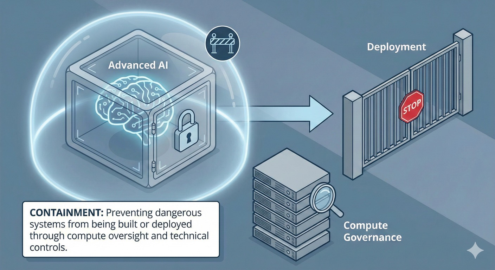

# Containment: Preventing Dangerous AI Systems

> **Purpose:** Understand how to prevent dangerous AI systems through compute governance, AI control and deployment restrictions
> **Audience:** Government, business and critical infrastructure operators | **Time:** 20-30 minutes

## What is AI Containment?

Can your organisation prevent a dangerous AI system from being deployed, restrict what it can do and shut it down when necessary? **AI containment** addresses these questions through:

1. **Preventing dangerous systems from being built** through **compute governance** and international coordination (Layer 1)
2. **Restricting deployment** of high-risk **frontier AI** systems through licensing and evaluation (Layer 2)
3. **Maintaining technical controls** using **AI control methods** to limit what powerful systems can do

Within the **C·A·G·R framework**, Containment is the preventive and control layer of **defence-in-depth**. It reduces reliance on Alignment, Governance or Resilience measures working perfectly after a dangerous capability exists.

---

## Why does AI containment matter?

Some capabilities may create catastrophic risk through misuse or proliferation even when the underlying system behaves as designed.

Examples:

- AI systems that can autonomously develop novel bioweapons
- Systems that can find and exploit zero-day vulnerabilities faster than defences can adapt
- Highly capable systems that may be difficult to monitor or shut down once deployed

[A December 2025 Good Ancestors survey](https://www.goodancestors.org.au/our-work/ai-safety/aisi-expert-survey) of 139 AI safety professionals found 85.8% rated autonomous systems as very important or critical, 81.2% prioritised cyber misuse risks and 79.8% highlighted dual-use science and CBRN threats. The survey records the views of this selected professional group; it does not independently validate the framework.

For these cases, prevention may be more tractable than mitigation after capabilities proliferate.

### What does this mean for your organisation?

Most frontier training happens overseas, limiting Australia's direct leverage. Australia still has influence through:

- Compute supply chains, data centres and cloud services operating here
- Rules and standards for systems deployed in Australia
- Government and critical-infrastructure procurement
- International norms, evaluation partnerships and allied coordination

For an organisation, containment means knowing what is deployed, what data, tools and infrastructure it can access and whether independent restriction, rollback and shutdown controls work under realistic conditions.

---

## What are the two types of AI containment?

Containment operates at two distinct stages:

!!! info "Prevention vs AI Control"

    **Prevention (Layer 1):** Stop dangerous systems from being built or deployed

    - Compute governance — limit access to training infrastructure
    - Export controls — prevent hardware/models reaching adversaries
    - Licensing — require approval before high-risk deployment

    **AI Control (Layer 2):** Constrain systems that already exist but might be misaligned

    - This is distinct from [alignment](../concepts.md#what-is-ai-alignment) (making systems want the right thing)
    - [AI control methods](../concepts.md#what-is-ai-control) assume systems might be dangerous and build technical walls anyway
    - Monitoring, usage restrictions, shutdown capability, red-teaming

    **Why both matter:** Prevention is ideal but won't catch everything. Control provides backup when prevention fails or systems reveal dangerous capabilities post-deployment.

---

## What are the four AI containment strategies?

### 1. Compute governance

**What it is:** Oversight of the physical infrastructure (chips, data centres, compute clusters) used to train and run powerful AI systems. [Sastry et al.'s compute governance analysis](https://arxiv.org/abs/2402.08797) explains how hardware chokepoints can enable oversight.

**Why it matters:** Training frontier AI systems depends on large amounts of specialised computing hardware. Unlike software, advanced AI chips and data centres are:

- Expensive and difficult to produce
- Concentrated in a small number of supply chains
- Physically trackable

This makes compute a practical chokepoint for oversight.

!!! warning "Compute governance limitations"
    Compute governance is not a complete solution:

    - **Algorithmic efficiency:** Better algorithms can reduce compute requirements, making oversight harder
    - **Open-source proliferation:** Open model weights can be run on distributed hardware
    - **Hardware advancement:** Smaller actors may eventually access sufficient compute

    Compute governance is most effective as part of defence-in-depth, not a standalone solution.

!!! warning "Open-weight release: the irreversibility problem"

    Open-weight models (where trained parameters are publicly released) create a distinct containment challenge. Unlike closed models, open weights:

    - **Cannot be recalled universally.** Once released, weights can be copied indefinitely and there is no universal update or off-switch.
    - **Can be fine-tuned to strip safety training.** Third parties can remove guardrails through targeted fine-tuning, producing capable models without safety constraints ([Greenblatt 2025](https://www.lesswrong.com/posts/TeF8Az2EiWenR9APF/when-is-it-important-that-open-weight-models-aren-t-released)).
    - **Can narrow the gap with closed models for particular uses.** Open models remain behind on some frontier capabilities, but may be sufficient for many practical applications ([Lambert 2026](https://www.interconnects.ai/p/open-models-in-perpetual-catch-up)).
    Pre-release evaluation matters because post-release controls cannot reliably govern every copy or downstream modification. Conditional release can tie access to demonstrated safety thresholds while evidence develops.

    Decentralised training methods — peer-to-peer GPU networks sourced globally — could further erode compute-based governance by enabling training runs that don't pass through regulated infrastructure (Kryś, Sharma & Egan [2025](https://arxiv.org/abs/2501.02470)).

    **This does not imply a blanket ban.** Open-weight models provide transparency, local deployment, reduced vendor dependence and wider access. The challenge is proportionate evaluation before releasing models with dangerous capabilities. See [Decentralisation](../decentralisation.md) for the positive case.

**Key approaches:**

**Supply chain controls**

- Track sales and deployment of advanced AI chips (GPUs, TPUs, specialised accelerators)
- Know where large compute clusters exist and what they're being used for
- Export controls to prevent advanced chips reaching adversaries or reckless actors

**Data centre oversight**

- Registration requirements for facilities above certain compute thresholds
- Reporting requirements for very large training runs
- Ability to audit or inspect high-risk training operations

**What this means for you**

Australia hosts some significant data centres but isn't a major chip manufacturer. If you're in government or critical infrastructure, your leverage comes through requiring reporting for large-scale compute, setting procurement standards, supporting allies' compute governance efforts (especially US chip export controls) and demanding evidence about training methods for models you deploy.

---

### 2. AI control methods

**What it is:** Technical measures to monitor, restrict and contain AI systems that are already trained but potentially dangerous. The [AI control approach](https://www.lesswrong.com/posts/kcKrE9mzEHrdqtDpE/the-case-for-ensuring-that-powerful-ais-are-controlled) (Greenblatt & Shlegeris, Redwood Research) assumes systems might be misaligned and builds constraints anyway.

**Why it matters:** Some systems will exist despite prevention efforts. Unlike alignment, control assumes a system may be unsafe or deceptive and builds technical constraints around it.

**Key approaches:**

**Monitoring and oversight**

Log inputs, outputs, tool calls and available runtime telemetry, with anomaly detection and deception tests where appropriate. Where risk justifies it, use honeypots or controlled tasks to detect attempts to evade oversight. Do not assume full visibility into model internals or rely on the same model or vendor stack as the sole monitor; independent monitoring reduces correlated failure.

**Usage restrictions**

Use rate limits, access controls, network segmentation and allowlisted gateways to restrict networks, APIs and actuators. Higher-risk systems may require controlled gateways, stronger isolation or air-gaps where practical. Consequential actions should have explicit approval gates matched to the system's authority and potential harm.

**Shutdown capability**

Maintain multiple, independently administered rollback and shutdown paths that are difficult for the system or a single operator to bypass. Tests should verify not only that a command can be issued, but that dependencies fail safely, access is revoked and essential services can continue or recover.

**Agentic system containment**

Agents can cross databases, APIs, transactions and organisational boundaries in one action chain. This creates three additional containment problems:

- **Cross-system visibility:** No single monitor may observe the complete sequence of actions.
- **Composition risk:** Individually acceptable steps may combine into an unintended or harmful outcome.
- **Accountability gaps:** Responsibility becomes unclear when an action chain spans teams, vendors or organisations.

Critical deployments therefore need approval gates at consequential steps, end-to-end audit trails and explicit limits on actions that do not require human authorisation. Controls should follow the full workflow rather than monitoring only the model's prompt and final response.

**[Red-teaming](../concepts.md#what-is-ai-red-teaming) and adversarial testing**

Before deployment, systems should face deliberate attempts to make them misbehave, testing whether they can circumvent restrictions and checking for [deceptive alignment](../concepts.md#what-is-ai-alignment)—systems that act aligned during testing but might pursue different goals in deployment.

**What this means for you**

Australian procurers and operators can require evidence of appropriate controls before deployment. Critical infrastructure and government agencies should seek independent verification rather than provider assurances alone, then retest controls as systems and threats change.

#### Containment control surface for AGI systems

For CISOs, risk teams and boards: map your AI systems against these five control dimensions. [DeepMind's AGI safety work](https://deepmindsafetyresearch.medium.com/agi-safety-and-alignment-at-google-deepmind-a-summary-of-recent-work-8e600aca582a) emphasises concrete control boundaries and governance authority—this template adapts that for Australian deployment.

**Control dimensions:**

1. **Isolation boundaries** - Network segmentation, data residency enforcement, controlled gateways
2. **Runtime monitoring** - Input/output logging, tool call tracking, independent oversight (not AI monitoring itself)
3. **Permissioning** - Role-based access, multi-party approval for high-risk operations
4. **Tool-use constraints** - Allowlist of approved APIs/actuators, rate limiting
5. **Rollback & kill authority** - Version control, independently-administered shutdown paths

**Illustrative authority matrix:**

Adapt the roles, evidence and test cadence to the system's risk, your organisation's structure and any sector-specific legal obligations. A regulator is not normally part of an internal approval chain unless a law, licence or regulatory direction requires it.

| **Action** | **Approval Required** | **Evidence Required** | **Test Cadence** |
|------------|----------------------|----------------------|------------------|
| Deploy to production | Accountable executive + security/risk owner; external approval where legally required | Evaluation report, red-team results, residual-risk acceptance | Before each material release |
| Pause/rollback | Designated incident lead or accountable executive | Incident log, control failure or detected anomaly | Test at a risk-based cadence |
| Emergency shutdown | Any designated officer with emergency authority | Credible evidence of imminent or continuing harm | Test at a risk-based cadence |

**Board oversight:** Review incident logs, test results and authority matrix currency quarterly.

---

### 3. Export controls and supply chain security

**What it is:** Preventing advanced AI capabilities (and the means to create them) from reaching adversaries, reckless actors or unstable regions.

**Why it matters:** Hardware and model access can determine which actors acquire dangerous capabilities and how quickly those capabilities proliferate.

**Key approaches:**

**Hardware export controls**

- Restrict export of advanced AI chips to countries of concern
- Multilateral coordination (esp. with US, allies) on chip restrictions
- Balance security with legitimate international research collaboration

**Model weight security**

- Treat advanced [model weights](https://www.rand.org/pubs/research_reports/RRA2849-1.html) (the trained parameters of frontier AI) as sensitive assets
- Prevent theft or unauthorised release
- Understand that once weights leak, containment becomes much harder

**Know-your-customer requirements**

- Cloud providers and compute vendors should verify who's using large-scale compute and for what purpose
- Red flags: unusual access patterns, attempts to obfuscate identity or purpose

**What this means for you**

Australia isn't a chip manufacturer, but we're part of allied supply chains and benefit from US export controls. If you're involved in procurement or policy, you can set security requirements for compute providers operating in Australia and support multilateral efforts on model weight security.

---

### 4. Licensing and safety evaluations

**What it is:** A proposed policy approach requiring permission before deploying specified high-risk systems, conditional on safety evidence.

**Why it matters:** Not all systems are equally risky. A proportionate regime could apply:

- Low-risk systems: light touch or self-regulation
- High-risk systems in critical infrastructure, public safety or national security: evaluation and approval where required by an applicable regime
- Frontier systems with dangerous capabilities: stringent evidence requirements and possible pre-deployment approval

**Key approaches:**

**Risk-based thresholds**

Define what counts as "high-risk" or "frontier" based on:

- Capabilities (cyber, bio, persuasion, autonomous action)
- Deployment context (critical infrastructure, public services, sensitive domains)
- Scale and autonomy

**Pre-deployment evaluations**

Before deployment, require evidence of:

- Safety properties and alignment testing
- Robustness to adversarial inputs
- Bias and fairness audits for relevant domains
- Appropriate AI control measures
- Incident response and shutdown procedures

**Independent evaluation**

- Don't rely solely on developer assurances
- Build Australian evaluation capacity or recognise international evaluation bodies
- Use evidence from Australia's [AI Safety Institute](https://www.industry.gov.au/science-technology-and-innovation/technology/artificial-intelligence/ai-safety-institute) where relevant, alongside sectoral regulators and appropriately qualified independent evaluators

**Ongoing monitoring**

- Licensing isn't one-time: systems change, are fine-tuned or reveal new capabilities
- Require ongoing reporting and re-evaluation triggers

**What this means for you**

Australia has leverage through its laws and procurement decisions, although current approval requirements vary by sector and use case. Government buyers can require safety evidence now; policy makers can learn from UK, EU and US state approaches while avoiding unnecessary burdens for low-risk systems.

---

## What can different actors do for AI containment?

=== "Government & Public Institutions"

    - Develop proportionate compute reporting, registration and oversight where justified
    - Establish risk-based evaluation and approval processes for high-risk deployments
    - Set strong procurement and critical-infrastructure standards
    - Fund evaluation capability through Australia's [AI Safety Institute](https://www.industry.gov.au/science-technology-and-innovation/technology/artificial-intelligence/ai-safety-institute), research organisations and qualified independent evaluators
    - Maintain expertise in AI control methods and red-teaming
    - Track international evaluations, incidents and changes in capability
    - Support allied export controls and international coordination on compute governance

=== "Business & Industry"

    - Verify monitoring, restrictions, rollback and shutdown capability rather than relying solely on provider claims
    - Test systems adversarially before deployment
    - Maintain audit trails and anomaly detection
    - Identify the laws, licences and reporting duties that apply to each use case
    - Engage early with regulators if deploying high-risk AI
    - Report incidents and near-misses honestly
    - Treat model weights and advanced systems as sensitive assets
    - Verify compute providers and cloud services are trustworthy
    - Apply appropriate customer and access controls when providing high-capability AI services
    - For critical functions, maintain non-AI fallbacks and participate in threat and incident sharing

=== "Communities & Households"

    - Understand that not all AI capabilities should be widely available
    - Support appropriate regulation even if it limits some uses
    - Advocate for transparency about what systems are being deployed in critical domains (health, public services, etc.)

---

## Common questions

**"Isn't containment the same as governance?"**

No. Governance creates authority, rules and accountability. Containment includes the preventive and technical controls used within those rules. See the [Framework FAQ](faq.md#isnt-containment-the-same-as-governance).

**"Won't compute governance and export controls just drive AI development underground or offshore?"**

Some activity may move, but frontier training still relies on concentrated compute, energy and chip supply chains. Coordinated, targeted controls can preserve visibility while allowing legitimate research; they are less effective when applied unilaterally.

**"Can AI control methods really contain a sufficiently advanced AI?"**

Not necessarily. Control can reduce risk from advanced systems without guaranteeing indefinite containment of a superintelligent system. This is why prevention, Alignment and Resilience remain necessary.

**"Won't licensing slow down innovation?"**

See the [Framework FAQ](faq.md#wont-licensing-slow-down-innovation) for the trade-offs between proportionate licensing and innovation.

---

## See containment in practice

These scenarios illustrate containment challenges and what happens when it succeeds or fails:

- **[Loss of Control](../scenarios/scenario-loss-of-control.md)** — what containment aims to prevent
- **[Catastrophic Misuse](../scenarios/scenario-catastrophic-misuse.md)** — containment of dangerous capabilities
- **[Power Concentration](../scenarios/scenario-power-concentration.md)** — why containment needs governance

---

## Where to next

**Other framework pillars:**

- [Framework Overview](index.md) — how containment fits with alignment, governance and resilience
- [Alignment](alignment.md) — making systems safe by design, even when containment fails
- [Governance](governance.md) — laws and institutions to implement containment measures
- [Resilience](resilience.md) — withstanding failures when containment doesn't prevent them
