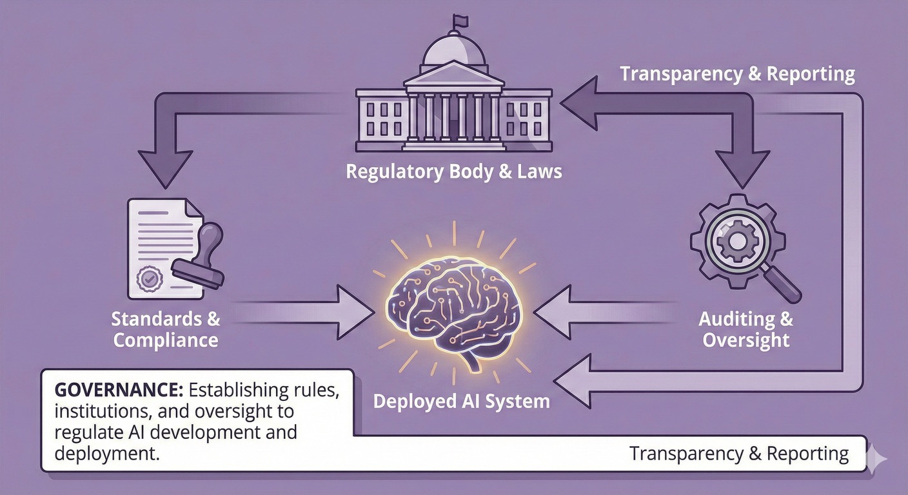

# Governance: Laws, Institutions and Coordination

> **Purpose:** Understand how laws, institutions and coordination shape safe AI development and deployment
> **Audience:** Government, policy makers, regulators and business leaders | **Time:** 25-35 minutes

## What is AI Governance?

When your organisation deploys AI, who is responsible if something goes wrong, what standards apply and who can audit its decisions?

**AI governance** encompasses the laws, institutions, standards and coordination mechanisms shaping how AI is developed, deployed and used. As a pillar of the **C·A·G·R framework**, it addresses **AI regulation**, **AI policy** and international coordination, including:

1. **Regulatory frameworks** including **risk-based AI regulation** that define rules and consequences
2. **Institutions** with clear, complementary roles—for example, Australia's **AI Safety Institute** for technical analysis and regulator support and sectoral regulators for statutory oversight and enforcement
3. **Transparency and accountability** mechanisms for **frontier AI** deployment
4. **International coordination** to avoid capability races and address shared **AI catastrophic risk**

Governance provides the social and legal infrastructure for containment, alignment and resilience. Even well-aligned systems need rules for appropriate deployment and redress when harm occurs.

---

## Why does AI governance matter even if AGI is perfectly safe?

!!! tip "Why governance matters even if AGI is perfectly safe"

    **Technical alignment solves one class of problems:** whether systems reliably do what their creators intend. It does not answer:

    - **Democratic participation:**
      Who decides how powerful AI systems are used? Do communities have input on what values AI reflects? Can citizens meaningfully participate in governance of transformative technology?

    - **Distribution and equity:**
      How are productivity gains distributed? Who benefits from AI-enabled growth? How do we prevent winner-take-all outcomes?

    - **Power and control:**
      What prevents concentration of control in a few companies or nations? How do democracies maintain sovereignty when dependent on foreign AI systems? Can institutions govern systems more capable than human experts?

    - **Legitimacy and values:**
      Whose values should AI systems reflect — creators, deployers or affected communities? How do we design institutions so AI serves the public interest as well as private goals? What activities should remain human even if AI can do them?

    **Even perfectly aligned AGI requires governance to answer these questions.** Technical safety is necessary but not sufficient for beneficial outcomes.

---

## What is the AI Governance Gap?

### The Governance Gap

Some AI capabilities and deployment practices are changing faster than governance systems can adapt. Many existing laws were not designed specifically for:

- Systems that can act autonomously at scale
- Capabilities that emerge unpredictably during training
- Global supply chains where training, deployment and impacts span jurisdictions
- Dual-use technologies where beneficial and harmful uses are inseparable
- Autonomous AI agents that chain actions across multiple systems, jurisdictions and organisations — with no clear liability framework for the consequences

**Agentic AI makes this gap acute.** Agents may search databases, make transactions and send communications across systems without a human decision-maker at each step. No single organisation may control the full chain, while model documentation may not give deployers enough detail to assess agentic risk.

**The result:** Regulatory uncertainty, accountability gaps and a risk that deployment is driven by commercial or geopolitical incentives rather than safety.

### What good governance achieves

- :material-file-check: **Clarifies responsibilities**

    ---

    Defines who approves high-risk deployment, who is liable and what standards apply.

- :material-timeline-check: **Provides predictability**

    ---

    Gives developers and deployers clear guardrails and reduces regulatory arbitrage.

- :material-account-check: **Enables accountability**

    ---

    Makes behaviour visible, creates consequences and supports learning from incidents.

- :material-earth: **Coordinates across borders**

    ---

    Helps prevent dangerous races, share risk information and build common standards.

---

## How should AI be governed? Competing approaches

There is no consensus on the right governance model for frontier AI. Three broad approaches have distinct trade-offs.

**Compute governance** uses the physical infrastructure of AI (chips, data centres, training runs) as a regulatory lever. Compute is physical, measurable and concentrated in a small number of supply chains — making it a practical chokepoint for oversight. But algorithmic efficiency gains erode thresholds over time and emerging decentralised training methods could eventually route around regulated infrastructure (Sastry et al. [2024](https://arxiv.org/abs/2402.08797); Kryś, Sharma & Egan [2025](https://arxiv.org/abs/2501.02470)).

**Private governance** combines lab self-regulation with third-party auditors (Ball [2025](https://arxiv.org/abs/2504.11501)). It is flexible but relies on voluntary compliance and a mature auditing ecosystem that may not yet exist — an assumption found in four of five major proposals reviewed by CSET ([Narayanan et al. 2025](https://cset.georgetown.edu/publication/ai-governance-at-the-frontier/)).

**Decentralised mechanisms** — distributed evaluation networks, community governance structures and cooperative ownership models — complement rather than replace the other approaches. See [Decentralisation](../decentralisation.md) for detailed analysis.

!!! info "Australia's practical position"

    No single approach is sufficient. Compute governance gives Australia leverage through procurement and data centre oversight. Private governance sets a floor that industry can adopt now. Decentralised mechanisms provide insurance against capture of state or market approaches. Australian policy should draw on all three.

---

## What are the five AI governance priorities?

### 1. Regulatory frameworks and standards

**What it is:** Laws, regulations and standards that define acceptable AI development and deployment practices.

**Key elements:**

**Risk-based regulation**
Not all AI systems need the same level of oversight. A proportionate framework:

- **Minimal risk:** General-purpose tools, low-stakes uses—light-touch regulation or self-regulation
- **High risk:** Systems in critical infrastructure, public safety, justice, health—mandatory requirements, evaluation, ongoing monitoring
- **Frontier systems:** Systems with potentially dangerous capabilities (advanced cyber, bio, deception, autonomous operation)—stringent pre-deployment approval, containment requirements

The [US NIST AI Risk Management Framework](https://www.nist.gov/itl/ai-risk-management-framework), [EU AI Act](https://artificialintelligenceact.eu/) and [UK approach](https://www.gov.uk/government/publications/ai-regulation-a-pro-innovation-approach) provide reference points, although Australia should tailor any approach to its legal system, institutions and capabilities.

**Possible mandatory requirements for high-risk systems**

- Safety evaluations before deployment
- Bias and fairness audits for relevant domains
- Human oversight for critical decisions
- Incident reporting and transparency obligations
- Ongoing monitoring and re-evaluation triggers

**Standards and certification**

- Technical standards for safety, robustness, interpretability
- Certification schemes (possibly tiered based on risk)
- Mutual recognition with trusted international partners

**What this means for you:**

- Australia currently combines existing laws and sectoral regulation with voluntary AI guidance and specialist institutions. The [Guidance for AI Adoption (AI6)](../../safety-standards/guidance-for-ai-adoption-ai6.md), published in October 2025, is the primary responsible-adoption guidance; its six essential practices evolve and incorporate the earlier Voluntary AI Safety Standard. See [AI Standards & Legislation](../../safety-standards/index.md) for current status
- The [National AI Plan](../../safety-standards/ai-australian-legislation.md) (December 2025) sets out this approach. Australia's AI Safety Institute is now operating within the Department of Industry, Science and Resources (as at July 2026)
- If you're in government procurement, you have immediate leverage: require safety standards before buying
- For business, understanding emerging requirements now helps you prepare before they become mandatory

---

### 2. Clear institutional roles and mandates

**What it is:** Ensuring government bodies and regulators have clear responsibilities, authority and resources for AI governance.

**The challenge:**

AI cuts across health, finance, critical infrastructure, defence and consumer protection. No single regulator "owns" AI safety. Without clarity, we get:

- Gaps (no one responsible)
- Overlaps (multiple agencies, unclear authority)
- Under-resourcing (everyone assumes someone else will handle it)

**Key institutional elements:**

**Lead coordination body**
A body (possibly within Treasury, Home Affairs or as independent agency) that:

- Coordinates AI policy across government
- Provides expertise and guidance to sectoral regulators
- Monitors international developments and helps Australian institutions respond
- Maintains relationships with international partners

**Sectoral regulators with AI mandates**
Existing regulators (ACCC, ACMA, APRA, TGA, etc.) need:

- Explicit mandates to address AI risks in their domains
- Technical expertise and resources
- Coordination mechanisms to address cross-cutting issues

**Evaluation and assurance capability**
Through Australia's AI Safety Institute, regulators, research organisations and appropriately qualified independent evaluators:

- Evaluate frontier and high-risk systems
- Develop evaluation methodologies
- Provide independent assurance (not just trusting developer claims)
- Support incident analysis and learning

METR's [Common Elements of Frontier AI Safety Policies](https://metr.org/common-elements) (2025) identifies nine recurring elements across major lab commitments: capability thresholds, model weight security, deployment mitigations, development and deployment halting conditions, full capability elicitation, evaluation timing and frequency, accountability and policy updates. This convergence could support a mandatory assurance standard.

**Research and horizon scanning**
Funding and mandate for:

- Understanding emerging capabilities and risks
- Technical AI safety research relevant to Australia
- Modelling scenarios and risk pathways
- International research collaboration

**What this means for you:**

Australia's [AI Safety Institute](https://www.industry.gov.au/science-technology-and-innovation/technology/artificial-intelligence/ai-safety-institute) is operating as a national technical capability. Its stated functions include analysing and testing models and applications, supporting regulators and agencies and contributing to international governance; statutory enforcement remains with the relevant regulators. [Expert survey data](https://www.goodancestors.org.au/our-work/ai-safety/aisi-expert-survey) from Good Ancestors (December 2025, n=139) predates the institute's launch and records respondents' preferred resourcing rather than its current budget or mandate. If you're engaging with government on AI policy, identify both the technical body and the regulator responsible for your sector.

---

### 3. Transparency and accountability mechanisms

**What it is:** Ensuring AI systems and their impacts are visible and that there are consequences when things go wrong.

**Why transparency matters:**

- Enables oversight (can't regulate what you can't see)
- Builds trust (or appropriately withholds it when evidence is lacking)
- Facilitates learning from failures and near-misses
- Creates reputational and market incentives for responsible behaviour

**Key mechanisms:**

**Mandatory transparency for high-risk systems**

For high-risk systems, require disclosure of where and why they are deployed, known limitations and failure modes, evaluation results, safety evidence and—where not commercially sensitive—data sources and training methods.

**Incident reporting**

Require protected reporting of significant failures, harms and near-misses. Where appropriate, a public incident database can support collective learning and improved standards.

**Audit rights**

Regulators need powers to audit high-risk systems. Critical infrastructure operators need audit rights over suppliers, while independent researchers need appropriately safeguarded access for safety research.

**Algorithmic impact assessments**

Sensitive-domain deployments should assess bias, fairness and safety, consult affected communities and document key decisions and trade-offs.

**Liability and redress**

Governance frameworks should clarify liability for AI harms and provide accessible redress while balancing innovation and accountability.

**What this means for you:**

Australian privacy law already includes a new automated decision-making transparency obligation that commences on 10 December 2026. Covered APP entities will need to describe in their privacy policies certain uses of personal information in substantially automated decisions that significantly affect individuals' rights or interests. Other transparency, audit and incident-reporting duties depend on the applicable law and sector. Regardless of whether reporting is legally required, establishing an internal AI incident process now builds useful practice and institutional knowledge. See the [OAIC's current guidance development](https://www.oaic.gov.au/engage-with-us/consultations/consultation-on-guidance-for-transparency-in-automated-decision-making) for scope and commencement details.

---

### 4. International coordination

**What it is:** Working with allies and international bodies to address AI risks that cross borders.

**Why international coordination matters:**

- Most [frontier AI](../concepts.md#what-is-frontier-ai) development happens outside Australia
- Unilateral regulation creates arbitrage (activity moves to weakest jurisdiction)
- Some risks (catastrophic misuse, [loss of control](../concepts.md#what-is-loss-of-control)) are inherently global
- Beneficial outcomes require avoiding races and sharing information

**Key priorities for Australia:**

**Strategic partnerships**

Cooperation with the US, UK and other Five Eyes partners, together with participation in the [International Network for Advanced AI Measurement, Evaluation, and Science](https://www.nist.gov/news-events/news/2026/02/international-network-advanced-ai-measurement-evaluation-and-science), can extend Australia's access to expertise and shared methods. A [Good Ancestors survey](https://www.goodancestors.org.au/our-work/ai-safety/aisi-expert-survey) (December 2025, n=139) found that 67.9% of its selected respondents viewed strong international institute connections as important to talent attraction. Bilateral and multilateral agreements can also support standards and information sharing.

**Avoid dangerous capability races**
- Support international efforts to slow or pause development of the most dangerous capabilities
- Advocate for safety taking precedence over speed
- Coordinate on [compute governance](../concepts.md#what-is-compute-governance) and export controls
- Contribute to monitoring and verification mechanisms

**Harmonise standards where possible**
- Mutual recognition of evaluations and certifications
- Common approaches to risk classification
- Interoperable incident reporting
- Reduces compliance burden for multi-national deployment

**Information sharing**
- Share threat intelligence and vulnerability information
- Learn from each other's regulatory approaches
- Coordinate on incident response for cross-border harms
- Balance openness with security (not all safety information should be public)

**Contribute to multilateral AI governance**
- Engage with [UN AI initiatives](https://www.un.org/digital-emerging-technologies/content/artificial-intelligence), [OECD AI Policy Observatory](https://oecd.ai/) and other multilateral forums
- Support development of international AI safety standards
- Advocate for strong safety priorities, not just commercial interests

**International landscape (as at July 2026)**

The [International AI Safety Report](https://internationalaisafetyreport.org/) (2026) provides a shared evidence base on misuse and malfunction risks, but national governance approaches still differ. Australia should plan for cooperation across several regulatory and technical networks rather than assume that a single global regime will emerge.

**Learning from peers**

The UK AI Security Institute (then the AI Safety Institute) shows how a mid-sized country can use coordination, technical expertise and relationships as leverage ([Stead & Whittlestone 2025](https://www.longtermresilience.org/reports/advancing-the-uks-global-leadership-in-frontier-ai-governance/)). Singapore provides another reference point for AI transparency and monitoring.

Australia's AI Safety Institute is already pursuing international coordination alongside its domestic testing and regulator-support functions.

Partnerships with peer institutes and standards bodies can expand Australia's access to evaluation methods and shared evidence as domestic assurance capability matures.

**What this means for you:**

Australia has strong relationships with key AI safety allies and is well-positioned to contribute to international coordination. If your organisation operates across borders, understanding emerging international standards helps you prepare. For policy makers, Australia's role may be convening, bridge-building and technical contribution rather than direct leverage over frontier labs—and advocating for our region (Pacific, Southeast Asia) in global governance.

---

### 5. Decentralised alternatives and democratic control

**What it is:** AI infrastructure that distributes power and enables community ownership and democratic participation.

**Why decentralisation matters:**

Concentrated control creates challenges that regulation alone cannot solve. These approaches complement regulation rather than replacing it. Decentralised alternatives can:

- **Distribute power:** Give more actors practical agency instead of depending on a few providers
- **Enable exit:** Let users switch systems or deploy locally when a provider no longer meets their needs
- **Create accountability through ownership:** Make community-governed cooperatives answerable to members
- **Support sovereignty:** Reduce dependence on foreign providers for suitable sensitive applications through local deployment

**Approaches include:**

**Open-source AI development**
- Models that communities can inspect, modify and deploy locally
- Transparent training and evaluation without a single access chokepoint

**Platform cooperatives and community ownership**
- Tools governed by users or workers through democratic decision-making
- Benefits distributed to members rather than distant shareholders

**Local deployment infrastructure**
- Local hardware that supports data sovereignty and operation when external services are unavailable

**Democratic governance models**
- Community input, participatory oversight and accountability to affected people

**What this means for you:**

Australia has existing cooperative institutions (see [BCCM - Business Council of Co-operatives and Mutuals](https://bccm.coop/)). If you're concerned about vendor lock-in or foreign-provider dependence, assess whether open-source or locally deployed alternatives can meet the use case and your security, support and governance requirements. These options can complement, but do not replace, national regulation and international coordination.

**Learn more:** See our [Decentralisation](../decentralisation.md) page for detailed guidance on building cooperative AI alternatives.

---

## What can different actors do for AI governance?

=== "Government & Public Institutions"

    **Set frameworks:**

    - Develop and pass AI regulatory frameworks (risk-based, proportionate)
    - Give sectoral regulators clear AI mandates and adequate resources
    - Establish evaluation and assurance capability
    - Lead international engagement

    **Enable accountability:**

    - Create transparency requirements and incident reporting mechanisms
    - Establish appropriate audit powers and enforcement capability
    - Update liability and consumer protection laws for AI
    - Build public trust through procedural fairness

    **Coordinate and resource:**

    - Central coordination body for whole-of-government approach
    - Fund AI safety research and capability development
    - Improve consistency across jurisdictions (Commonwealth, states and territories)
    - Maintain horizon scanning and scenario planning

=== "Business & Industry"

    **Comply and engage:**

    - Understand and comply with regulatory requirements
    - Engage constructively with regulators and standard-setting bodies
    - Don't wait for perfect regulation—adopt best practices now

    **Be transparent:**

    - Disclose capabilities, limitations and risks honestly
    - Report incidents and near-misses
    - Allow appropriate audit and evaluation
    - Participate in information sharing (where security allows)

    **Self-regulate where appropriate:**

    - Industry bodies can develop codes of practice
    - Internal governance (boards, risk committees) should address AI
    - Build safety culture, not just compliance culture

    **Critical infrastructure and high-risk deployers:**

    - Identify the higher standards or obligations that apply in your sector and meet them
    - Engage early with regulators if deploying frontier or high-risk systems
    - Maintain capability to audit and oversee your AI suppliers

=== "Communities & Households"

    **Hold institutions accountable:**

    - Demand transparency about AI systems in public services
    - Advocate for strong protections, especially in sensitive domains
    - Participate in consultations on AI regulation
    - Support appropriate regulation even if it constrains some uses

    **Understand governance:**

    - Know what protections exist (or don't) in domains that affect you
    - Understand how to seek redress if harmed by AI systems
    - Advocate for accessible redress mechanisms

---

## Common questions

**"Won't regulation stifle innovation?"**

Risk-based regulation shouldn't. Low-risk AI continues with minimal barriers while high-risk systems get appropriate scrutiny. Clear rules reduce uncertainty and enable responsible innovation. Aviation, medicine and finance show safety regulation and innovation can coexist. The risk of under-regulation (catastrophic failures, loss of public trust) may exceed over-regulation risk.

**"Can Australia really influence global AI development?"**

Not through unilateral regulation of frontier training (mostly happens overseas). But our laws govern deployment here, procurement standards influence global providers, strategic partnerships amplify our voice and technical contributions (evaluation, research) matter regardless of size.

**"Why not just let industry self-regulate?"**

See the [Framework FAQ](faq.md#why-not-just-let-industry-self-regulate) for the role and limits of voluntary frontier-lab safety policies.

**"Isn't international coordination unrealistic given geopolitical tensions?"**

Difficult, not impossible. Precedents include nuclear arms control during Cold War, pandemic preparedness and aviation safety across competing nations. AI safety favours coordination: shared risks (catastrophic outcomes harm everyone), technical complexity creates room for epistemic communities and safety can enable rather than constrain beneficial use. Coordination will be partial and imperfect, but worth pursuing.

---

## See governance in practice

These scenarios illustrate governance challenges and what happens when it succeeds or fails:

- **[Power Concentration](../scenarios/scenario-power-concentration.md)** — governance failure and regulatory capture
- **[Information Ecosystems](../scenarios/scenario-information-ecosystems.md)** — governing AI in public discourse
- **[Gradual Disempowerment](../scenarios/scenario-gradual-disempowerment.md)** — governing economic transformation

---

## Where to next

**Other framework pillars:**

- [Framework Overview](index.md) — how governance coordinates containment, alignment and resilience
- [Containment](containment.md) — technical and preventive measures that governance can support
- [Alignment](alignment.md) — governance creates incentives and requirements for aligned systems
- [Resilience](resilience.md) — governance enables coordination across actors for crisis response
