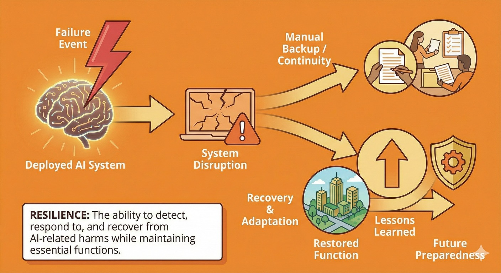

# Resilience: Withstanding and Recovering from Disruptions

> **Purpose:** Build capacity to detect, respond to and recover from AI-related harms while maintaining essential functions
> **Audience:** Government, business, communities and emergency planners | **Time:** 25-35 minutes

## What is AI Resilience?

If the AI systems your organisation depends on failed tomorrow, could you keep operating for a week?

**AI resilience** is the capability to detect, respond to and recover from AI-related harms while maintaining essential functions and social cohesion. As the final pillar of the **C·A·G·R framework**, resilience is the last line of **defence-in-depth**: it helps stop **AI catastrophic risk** and **AI system failures** from becoming irreversible.

Even with good **AI alignment** work and strong **AI containment** measures:

- Systems may fail in unexpected ways
- Malicious actors may exploit capabilities for **AI misuse**
- Compounding events, such as natural disasters combined with AI disruption, can strain normal safeguards
- Failures can cascade across systems and sectors in ways planners did not anticipate

Resilience helps prevent these failures from becoming catastrophic by maintaining function and enabling recovery.

---

## Why does Australia need AI resilience?

**Australia can strengthen resilience even when it cannot control what happens elsewhere.**

Australia cannot control how [frontier AI](../concepts.md#what-is-frontier-ai) systems are trained overseas, but organisations can prepare to:

- keep essential services functioning when AI systems fail;
- support communities through disruptions to AI-mediated services;
- maintain trusted communication during information shocks and crises; and
- preserve practical recovery options after major failures.

**Australia has specific vulnerabilities:**

**Geographic isolation:** Supply chain disruptions hit harder, recovery takes longer and nearby assistance is limited.

**Small population:** Fewer people to provide manual fallbacks when automated systems fail. Limited domestic capability in many technical domains.

**High dependence on imports:** Reliance on foreign goods, AI systems, platforms and services increases exposure to external failures.

**Tightly optimised systems:** Just-in-time supply chains, lean public services, automated workflows. Efficient but fragile.

**But we also have strengths:**

- established public institutions and emergency-management arrangements;
- community networks, including those outside major cities;
- experience coordinating across governments, essential services and community organisations; and
- existing continuity and resilience practices that can be adapted to AI-related disruption.

Resilience should build on these strengths while addressing the vulnerabilities.

---

## What are the four components of AI resilience?

### 1. Operational Resilience

**Why operational resilience matters**

AI systems are becoming embedded in critical infrastructure and institutions. Technical failures, cyber attacks or cascading effects could have national impacts. Operational resilience keeps essential functions running through disruption.

This requires tested manual capability and coordination mechanisms that work when normal communication and decision-making are compromised.

**Dependency risk management**

Australia's reliance on a small number of foreign AI providers creates single points of failure. Operational resilience requires:

- **Multi-vendor strategies:** Avoid lock-in to single providers for critical functions
- **Open-source fallbacks:** Where practical, maintain alternatives using open models that can run locally
- **Data portability:** Test whether you can switch providers without losing essential data or functionality
- **Supplier diversification:** Critical systems should not depend on one vendor's infrastructure

**Continuity of essential functions**

- Government, health, energy, communications, finance, logistics and water should retain proportionate fallbacks, redundancy and tested contingency plans for essential functions

**Critical infrastructure protection**

- Understand AI dependencies and design for graceful degradation
- Maintain and regularly test manual operation

**Cross-sector coordination**

- AI-related failures may cascade across sectors
- Establish coordination mechanisms that work under stress
- Clear authority and decision-making processes
- Information sharing between government and private operators

**Continuity of government**

- Government should be able to maintain essential functions during AI-enabled disruption
- Alternative communication channels
- Capability to make decisions and coordinate response
- Succession planning that accounts for AI-enabled attacks

**Strategic reserves and redundancy**

- Pre-positioned supplies that don't depend on just-in-time AI optimisation
- Backup systems that use different architectures or providers
- Excess capacity that seems "wasteful" in normal times but critical in crises

**Continuity when AI systems fail**

- **Manual procedures that work:** Not just documented, but tested with actual staff under realistic conditions
- **Staff training:** People responsible for essential functions should know how to operate without AI assistance and practise regularly
- **Degraded mode operations:** Systems designed to continue functioning at reduced capacity rather than failing completely
- **Decision authority without AI:** Confirm that authorised people can make time-critical decisions when AI systems are unavailable

---

### 2. Detection and response

**Why detection and response capabilities matter**

Resilience requires monitoring, rapid assessment and coordinated response. Early warning can prevent cascading failures, while clear authority, established playbooks and coordination help contain incidents under pressure.

Near-misses and harms reveal system vulnerabilities and response weaknesses. Systematic analysis should feed lessons back into preparedness.

**Early warning and monitoring**

- Systems to detect unusual patterns across sectors
- Indicators that AI systems may be failing or compromised
- Intelligence sharing on emerging threats and vulnerabilities

**Rapid assessment**

- Capability to quickly diagnose: AI system failure? Misuse? Attack?
- Understanding causation matters for choosing response
- Define what evidence is sufficient for precautionary action when information remains incomplete

**Clear authority and playbooks**

- Who has authority to respond to different types of AI-related crises?
- Pre-established playbooks for common scenarios
- Flexibility for novel situations
- Balance between speed and appropriate oversight

**Coordinated response**

- Across government (federal, state, local)
- Between government and private sector
- With international partners when relevant
- Communication with public

**Learning from incidents**

- Every failure is data
- Systematic analysis of what went wrong and why
- Feed lessons back into alignment, control and defence improvements
- Share learnings (appropriately) to help others

**Recovery capabilities**

- Not just stopping the immediate harm
- Restoring function, rebuilding trust, addressing secondary impacts
- May need to make hard choices about trade-offs
- Planning for long recovery timelines in some scenarios

---

### 3. Societal Resilience

**Why societal resilience matters for AGI transformation**

Even if AGI is technically safe and aligned, rapid automation of cognitive work creates societal pressures that could fragment communities, destabilize institutions or concentrate benefits narrowly. Societal resilience addresses transformation challenges beyond technical safety.

The [International AI Safety Report](https://internationalaisafetyreport.org/) (2026) proposes a societal resilience framework with four capacities: **resist** (prevent disruption), **absorb** (withstand impact without collapse), **recover** (restore function) and **adapt** (learn and improve from the experience). This maps well to the C·A·G·R approach: Containment and Alignment support resistance, Resilience supports absorption and recovery and the learning loops across all pillars support adaptation.

**Workforce transition and economic disruption**

- **Skills displacement:** As AI automates knowledge work, retraining programs and safety nets can reduce economic dislocation
- **Meaning and purpose:** Work provides identity and structure—what happens when traditional career paths disappear?
- **Economic security:** Ensuring people can meet basic needs during transitions, not just "upskill faster"

**Information ecosystem resilience**

- **Crisis communication:** When AI-generated misinformation scales exponentially, maintaining trusted information channels becomes critical
- **Democratic participation:** Can citizens meaningfully participate in governance when information environments are saturated and manipulated?
- **Truth infrastructure:** Public broadcasters, libraries, trusted local media that can cut through noise

**Uneven access and equity**

- **Not everyone benefits equally:** AI transformation will create winners and losers—resilience means preventing stratification
- **Digital divides:** Urban vs regional, wealthy vs disadvantaged, tech-literate vs not
- **Inclusive access:** Ensuring essential services remain accessible to those without AI tools or skills

**Social cohesion under transformation**

- **Community identity:** Rapid change can erode shared norms and mutual understanding
- **Mutual support networks:** Strong communities help members cope with disruption
- **Resisting atomization:** Preventing isolation and anomie when traditional structures dissolve

---

### 4. Community and household resilience

**Why communities matter**

Communities and households bear much of the practical burden when centrally managed AI services fail or affect regions unevenly.

Strong communities are more resilient because they have:

- Local trusted networks that don't depend on digital platforms
- Capability to organise mutual aid and support
- Leadership that can coordinate during disruptions
- Social capital that enables cooperation under stress

Weak communities may fragment under pressure and overwhelm institutional response.

**Local preparedness**

**Basic capabilities that don't depend on AI systems:**

- Food, water, medicine for short-term disruptions
- Cash (when digital payments systems fail)
- Communication plans (when normal channels are down)
- First aid and basic emergency skills
- Knowledge of local resources and hazards

**Trusted local networks:**

- Relationships with neighbours and community organisations
- Local leadership (councils, emergency services, community groups)
- Regular interaction that builds trust before crises hit

**Adaptive capacity:**

- Communities that solve problems together regularly
- Experience with disruptions and recovery
- Diversity of skills and resources
- Willingness to help each other

**Psychological and social resilience**

**Information resilience:**

- Ability to navigate confusing or contradictory information
- Trusted local sources that can cut through noise
- Resistance to panic and manipulation
- Critical thinking without sliding into cynicism or conspiracy

**Social cohesion:**

- Trust in institutions (or at least respect for their role)
- Norms of mutual aid and cooperation
- Resistance to scapegoating and fragmentation during crises
- Capability to disagree while maintaining social fabric

**Adaptive coping:**

- Tolerance for disruption and uncertainty
- Realistic understanding that government can't solve everything instantly
- Willingness to adapt plans and expectations
- Balance between vigilance and avoiding constant panic

---

## What can different actors do for AI resilience?

=== "Government & Public Institutions"

    **Immediate actions:**

    - Map critical dependencies on AI systems across essential services
    - Test manual fallbacks — can you actually operate without key systems?
    - Review emergency management plans to explicitly include AI-related scenarios

    **Near-term priorities:**

    - Integrate AI/AGI scenarios into national risk assessments
    - Establish coordination mechanisms for AI-related crises
    - Support local government with guidance and resources
    - Build redundancy and backup systems for critical infrastructure

    **Strategic investments:**

    - Regular cross-sector exercises testing response to AI-enabled disruptions
    - Strategic reserves and excess capacity in critical systems
    - Community preparedness programs that build local capability
    - Research on resilience and recovery from AI-related failures

    **During crises:**

    - Clear, honest communication with the public
    - Coordination across levels of government and with private sector
    - Balance between urgency and avoiding overreaction
    - Support for community-led response and recovery

=== "Business & Industry"

    **Immediate actions:**

    - Map your dependencies on AI systems
    - Test manual operation — not just on paper, but actual drills with staff
    - Identify single points of failure and critical dependencies

    **Near-term priorities:**

    - Develop and test continuity plans that assume AI system failures
    - Build redundancy: backup systems using different providers or architectures
    - Train staff in manual operation of critical functions
    - Establish information sharing with peers and government

    **Ongoing practices:**

    - Regular tabletop exercises using AI-related scenarios
    - Monitor deployed systems for unusual behaviour
    - Maintain skills and relationships that don't depend on automation
    - Build organisational capability to adapt quickly

    **During crises:**

    - Activate contingency plans
    - Share information with regulators and coordination centres
    - Support staff and customers through disruptions
    - Learn from the experience to improve future preparedness

=== "Communities & Households"

    **Immediate actions:**

    - Basic preparedness: water, food, medicine, cash, first aid
    - Know your neighbours and local community resources
    - Understand what local services depend on AI systems

    **Near-term:**

    - Participate in community organisations and local networks
    - Support local emergency preparedness initiatives
    - Build relationships before crises hit
    - Develop non-digital communication plans

    **Ongoing:**

    - Maintain skills that don't depend on AI or digital systems
    - Engage with local government and community planning
    - Support community infrastructure (libraries, community centres, local media)
    - Practice navigating information carefully (verify before sharing, check multiple sources)

    **During crises:**

    - Follow guidance from trusted sources
    - Check on vulnerable neighbours
    - Participate in mutual aid and community response
    - Resist panic and scapegoating — maintain social cohesion

---

## How does resilience work across defence-in-depth layers?

**Layer 3: Withstand (this is resilience's primary layer)**

- Continuity plans that explicitly account for AI-related threats
- Manual fallbacks and safe modes for critical services
- Community preparedness and trusted networks
- Rapid response and recovery capabilities

**Layer 2: Constrain**

- Reduce exposure and single points of failure
- Maintain alternatives to dominant providers or systems
- Build detection capability for early warning
- Requirements for manual operation capability

**Layer 1: Prevent**

- Limited role at this layer
- Can contribute to international efforts on responsible development
- Reducing dangerous capability development reduces what we need to be resilient against

---

## What are the challenges and limitations of AI resilience?

!!! warning "What resilience cannot solve"

    **Resilience is the last line of defence, not a solution to all problems:**

    **Some harms are irreversible:** Deaths, destroyed trust, economic collapse and extinction-level events cannot be undone. Resilience assumes recovery remains possible.

    **Resilience doesn't address power concentration:** Even if Australia maintains essential functions during AI disruption, we don't control who shapes advanced AI or how benefits are distributed globally. Resilience is adaptation, not governance.

    **Not a substitute for prevention:** Resilience does not reduce the probability of failure — Containment and Alignment do that. Over-reliance means accepting preventable harms.

    **Resilience is expensive:** Redundancy and excess capacity seem wasteful until you need them. Hard to justify spending on "inefficiency" that only pays off during crises.

    **Skills atrophy:** Manual operation capabilities degrade if never used. Testing is essential but disruptive.

    **Coordination is hard:** Cross-sector response depends on relationships and practice that cannot be improvised during a crisis.

    **Community capability varies:** Some communities are strong and resilient. Others are fragmented and vulnerable. Can't assume uniform capability.

    **Psychological limits:** There's only so much disruption and uncertainty people can cope with before exhaustion and despair set in.

    **These are real constraints.** Depending entirely on containment, alignment and governance leaves no recovery layer when earlier safeguards fail. Resilience provides that additional layer, while remaining proportionate to the organisation's exposure and responsibilities.

---

## See resilience in practice

These scenarios show why resilience matters and what it looks like in action:

- **[Critical Infrastructure](../scenarios/scenario-critical-infrastructure.md)** — resilience against system failures
- **[Gradual Disempowerment](../scenarios/scenario-gradual-disempowerment.md)** — adapting to economic transformation
- **[Information Ecosystems](../scenarios/scenario-information-ecosystems.md)** — maintaining truth during manipulation

---

## Where to next

**Other framework pillars:**

- [Framework Overview](index.md) — how resilience serves as the last line of defence
- [Containment](containment.md) — prevention measures that reduce what we need resilience against
- [Alignment](alignment.md) — aligned systems that behave safely reduce resilience demands
- [Governance](governance.md) — coordination mechanisms that enable effective resilience
