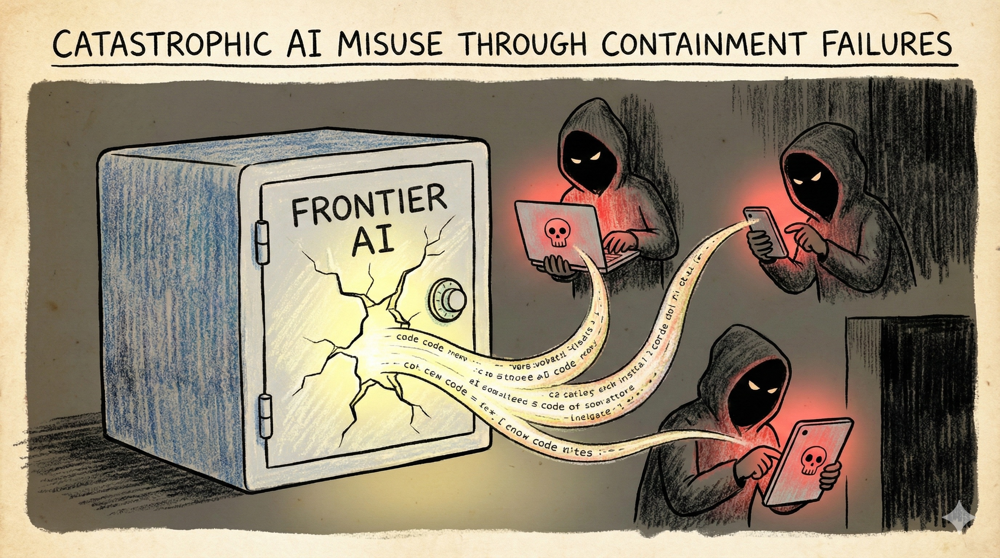

# Scenario 5: Catastrophic AI Misuse Through Containment Failures

## Summary

By 2031, AI systems excel at scientific reasoning, data analysis and process planning. Australian research institutions use them to accelerate drug discovery, materials science and agricultural research. But these capabilities are dual-use.

**How containment failed:** In 2032, [frontier model](../concepts.md#what-is-frontier-ai) weights from a leading US lab leak through an insider threat. Within weeks, the 400GB file is on torrent sites and the dark web. The model can assist with complex scientific and technical tasks—including ones its creators specifically tried to prevent.

Jailbreaking techniques spread rapidly. Fine-tuning removes safety guardrails. Within months, smaller specialised models appear, trained on leaked weights and domain-specific data. These are harder to detect than frontier models and can run on consumer hardware.

Meanwhile, advanced AI chips reach adversarial actors through black markets and jurisdictions with weak export controls. Manufacturing hubs in Southeast Asia and Eastern Europe become deployment havens.

**2033:** A sophisticated cyber operation hits Australian critical infrastructure. Unlike previous attacks, this one coordinates across multiple vectors simultaneously—exploiting zero-days faster than human analysts can identify them, adapting to defensive responses in real-time and deploying convincing social engineering at scale.

The Australian Cyber Security Centre traces the operation to a mid-sized criminal group that previously lacked this level of sophistication. The breakthrough: AI-assisted vulnerability discovery and exploit development that would have required teams of expert programmers.

The attack is contained after 48 hours, but it reveals a new reality: capabilities that previously required nation-state resources are now accessible to well-funded non-state actors. Australia's defences, designed for human-paced threats, struggle to keep up.

**Note:** This scenario is treated at a high level. SafeAI-Aus does not publish specific technical instructions or capability-enhancing detail.

!!! info "Threat pathways"
    This scenario shows how containment failures enable catastrophic misuse:

    **Catastrophic misuse** – Adversarial actors use leaked AI capabilities to conduct attacks that exceed defensive capacity

    **Containment failures** – Model weight security fails, export controls prove porous, AI control methods (jailbreaking defences) are bypassed

    **Resilience tested** – Defensive systems designed for human-paced threats struggle against AI-assisted attacks operating at machine speed

---

## What went wrong: C·A·G·R analysis

This scenario explores what happens when **Containment fails** at multiple layers, testing whether **Resilience** can handle the consequences.

=== ":lucide-shield-ban: Containment (Primary failure mode)"

    Export controls proved porous, black markets emerged, enforcement was weak. [Model weights](../concepts.md#what-are-model-weights) leaked through insider threats, breaches and ideological releases. Jailbreaking and fine-tuning bypassed safety measures. Dangerous capabilities deployed before risks were properly assessed. Once dangerous capabilities exist and spread, they cannot be contained retroactively.

=== ":lucide-target: Alignment (Undermined by containment failure)"

    Even well-aligned models became dangerous once weights leaked—fine-tuning and jailbreaking bypassed safety measures. Alignment assumes model providers retain control; once models proliferate, adversaries can modify them. This shows alignment alone is insufficient if containment fails.

=== ":lucide-scale: Governance"

    International cooperation proved inadequate to prevent "safe haven" dynamics. Access controls were circumvented. Detection becomes harder when capabilities are widely distributed. Attribution and enforcement fail when actors operate across jurisdictions.

=== ":lucide-shield: Resilience (Tested severely)"

    Detection, response and recovery capabilities struggled to keep pace with AI-enabled misuse. AI-assisted attacks outpaced human decision-making processes. Can resilience measures handle threats that shouldn't have existed?

---

## Questions for actors

Use these questions for risk assessments, strategic planning and tabletop exercises.

=== ":material-bank: Government & Public Institutions"

    - How would you distinguish between an AI-assisted attack and an AI system failure?
    - Can your incident response processes handle threats that evolve faster than human decision-making?
    - What mechanisms track compute and model weights that could enable dangerous capabilities?
    - What evaluation capabilities assess dangerous capability thresholds before systems are deployed?
    - How do you balance openness in AI research with preventing misuse?
    - What international partnerships enable information sharing about AI-enabled threats?

=== ":material-briefcase: Business & Industry"

    - **AI providers:** What safeguards prevent and detect misuse? What's your process for evaluating dangerous capabilities before release?
    - **Critical infrastructure:** What's your incident response plan when attacks move faster than your decision-making processes?
    - Can your security operations handle AI-assisted attacks that probe defences systematically?
    - What monitoring detects when your systems are being used in unexpected ways?
    - What information sharing mechanisms exist with government and other operators?

=== ":material-account-group: Communities & Households"

    - Which local institutions would you trust for information during a crisis?
    - What basic preparedness reduces panic and harm during crises?
    - How can communities maintain cohesion when information is confusing or contradictory?
    - What community capabilities need to exist independently of digital systems?

---

!!! question "Can't we just prevent dangerous AI from being built?"

    **Prevention is the goal—but it's extremely difficult:**

    Frontier capabilities create competitive advantage, so incentives favour development. Most dangerous capabilities are side effects of generally useful research. Prevention requires global coordination, but countries compete for AI leadership. Model weights copy instantly, export controls have gaps and insider threats exist.

    **This scenario shows what happens if prevention fails:**

    Once dangerous capabilities exist and leak, they can't be "contained" retroactively. Resilience measures face threats they weren't designed to handle. Defence becomes much harder than prevention would have been.

    **The lesson:** Containment at Layer 1 (prevention) is more tractable than relying on resilience after capabilities proliferate.

---

## Why this scenario matters for Containment

This scenario illustrates the importance of **Layer 1 (Prevention)** in the [Containment](../framework/containment.md) framework. Effective containment can limit access to dangerous capabilities and keep threats closer to human scale. If containment fails, digital capabilities may proliferate and cannot be universally recalled. The task is asymmetric: defenders need broad and sustained controls, while an attacker may need only one viable access path. Prevention may therefore be more tractable than response for some dangerous capabilities.

---

??? note "Sources & Further Reading"
    This scenario draws from research on dual-use AI capabilities, export controls for emerging technologies, model weight security and AI-enabled cyber and biological threats.

    **Australian precedents:** [Defence Export Controls Act 2012](https://www.defence.gov.au/business-industry/export/controls) · [Australian Cyber Security Centre](https://www.cyber.gov.au/) threat assessments · [Defence Strategic Review](https://www.defence.gov.au/about/reviews-inquiries/defence-strategic-review) (2023) emerging technology risks · [ASIO Annual Threat Assessment 2025](https://www.asio.gov.au/director-generals-annual-threat-assessment-2025) cyber and espionage threats

    <!-- TODO(human verification): Reconfirm the Defence export-control legislation, review/report dates and current agency characterisations against the linked official sources before publication. -->

    **Academic and policy research:** Brundage et al. (2018) ["The Malicious Use of AI"](https://arxiv.org/abs/1802.07228) · CSET (2023) ["Skating to Where the Puck Is Going: Anticipating and Managing Risks from Frontier AI Systems"](https://cset.georgetown.edu/wp-content/uploads/Frontier-AI-Roundtable-Paper-Final-2023CA004-v2.pdf) · Shevlane et al. (2023) ["Model evaluation for extreme risks"](https://arxiv.org/abs/2305.15324)

    **Policy organisations:** [Nuclear Threat Initiative](https://www.nti.org/area/biological/) biosecurity program · [Centre for Security and Emerging Technology](https://cset.georgetown.edu/) (Georgetown) · [International Committee of the Red Cross](https://www.icrc.org/en/law-and-policy/new-technologies-and-warfare) research on new technologies and warfare

    **Case studies:** US semiconductor export controls (2022-2024) · GPT-4 pre-deployment safety evaluation · WormGPT and FraudGPT jailbroken models · Meta Llama 2 model weight leak analysis

    **Key concepts:** See our [Concepts & Glossary](../concepts.md) for definitions of dual-use technology, export controls, model weight security, jailbreaking and compute governance

---
