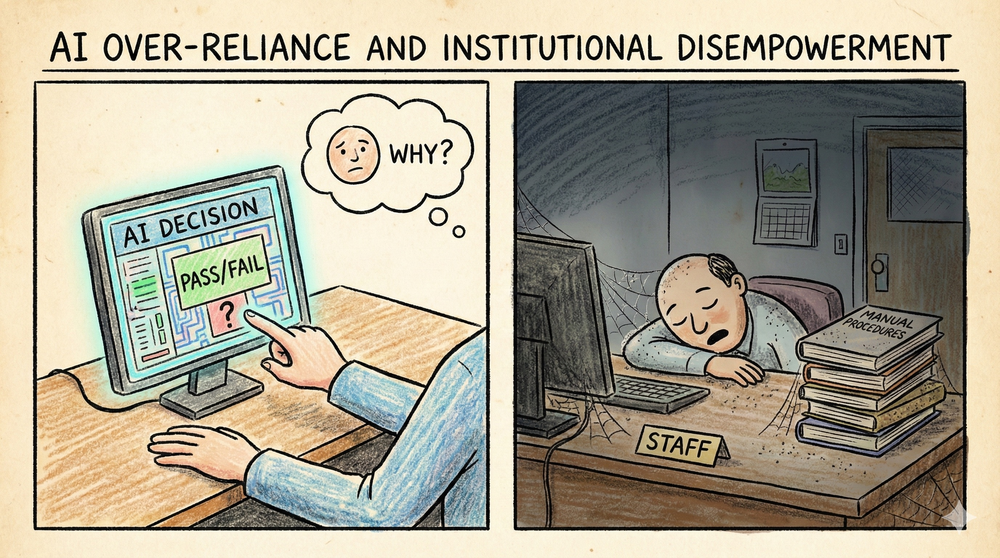

# Scenario 2: AI Over-Reliance and Institutional Disempowerment

## Summary

In 2029, Services Australia deploys an AI system to assess welfare eligibility and payment amounts. Initial results are promising: faster processing, fewer errors, more consistent decisions. By 2031, 85% of Centrelink decisions are AI-recommended, with human case workers reviewing only flagged cases.

Meanwhile, major banks adopt AI credit assessment systems. NAB, CommBank and Westpac all licence similar models from the same US provider. Loan officers can see the AI's decision but rarely understand its reasoning. Overruling the system triggers compliance reviews. By 2032, manual overrides drop to less than 2%.

State health departments follow suit: AI triage in emergency departments, AI-assisted diagnosis in Medicare-funded consultations, algorithmic resource allocation during the 2033 flu season. In each case, the promise is efficiency and consistency.

**The erosion is gradual.** By 2036, when a bank's AI system denies mortgages to an entire postcode without explanation, nobody on staff can articulate why. When a hospital's resource allocation algorithm prioritises certain demographics during a crisis, the review finds that current staff don't understand the system well enough to identify the bias—and the vendor's technical team is overseas.

Citizens trying to appeal decisions face Kafka-esque loops: "the system determined..." with no human who can explain or override it. Skills have atrophied. The ability to operate manually—even in a crisis—has been lost.

!!! info "Threat pathways"
    This scenario illustrates two interconnected pathways:

    **Gradual disempowerment** – Incremental automation causes skills atrophy and loss of manual operation capability

    **Power concentration** – Dependencies on vendor systems create lock-in; accountability becomes obscured across complex supply chains

---

## What went wrong: C·A·G·R analysis

This scenario explores how incremental automation erodes human capability and institutional resilience over time. The gradual nature makes it difficult to reverse, testing whether organisations can maintain essential functions when AI dependencies become too deep.

=== ":lucide-shield-ban: Containment (Defeated by incrementalism)"

    No dramatic failure triggered containment measures—gradual expansion never crossed obvious red lines that would halt deployment. Each individual automation decision seemed reasonable; only aggregate effects across many deployments created systemic dependency. By the time disempowerment became obvious, rolling back required rebuilding capabilities that had atrophied. Containment designed for sudden threshold-crossing events proved ineffective against "boiling frog" dynamics.

=== ":lucide-target: Alignment"

    Systems nominally "aligned" with policy objectives, but real-world values drift goes unnoticed. Feedback loops favour efficiency and cost over fairness, robustness or contestability. Misalignment manifests as systematic bias that compounds over time.

=== ":lucide-scale: Governance"

    Formal oversight remains but weakens as human understanding degrades. Accountability blurs: "the system recommended it." Regulatory frameworks struggle when the regulated can't explain their own processes.

=== ":lucide-shield: Resilience (Primary failure mode)"

    Skills and institutional knowledge atrophied as AI automation deepened. In crises, institutions struggled to revert to manual processes—capability had been lost, not just set aside. Citizens felt increasingly powerless when they could not contest AI decisions, undermining trust in institutions. Recovery took longer because human expertise had to be rebuilt from scratch.

---

## Questions for actors

Use these questions for risk assessments, strategic planning and tabletop exercises.

=== ":material-bank: Government & Public Institutions"

    - Pick one decision workflow involving AI. Who actually has power to overrule the AI? Has anyone done so recently?
    - What skills are you actively maintaining even though AI can do those tasks? Are junior staff learning them?
    - If your primary AI system was unavailable for a week, how long would it take to restore full manual operation?
    - Where are decisions effectively being delegated to AI and what meaningful human oversight exists in practice?
    - How are contestability, redress and transparency protected as automation expands?

=== ":material-briefcase: Business & Industry"

    - When did someone last overrule an AI recommendation? Were they rewarded or discouraged?
    - Are performance metrics designed to optimise AI efficiency, human oversight or both?
    - Could key staff actually perform their jobs manually if systems failed?
    - Are staff empowered and trained to challenge AI outputs or is challenge discouraged in practice?

=== ":material-account-group: Communities & Households"

    - How easy is it to appeal an AI-mediated decision that affects you?
    - What community resources help people who can't navigate automated systems?
    - Which local organisations still maintain human decision-making capacity?
    - Which decisions should never be fully automated, even if AI could handle them efficiently?

---

!!! question "Isn't automation just efficiency? Why is this a problem?"

    **Efficiency gains are real—but they come with trade-offs:**

    - Individual automation decisions improve productivity
    - But aggregate dependency creates vulnerability when systems fail
    - Skills atrophy means you can't revert to manual operation quickly
    - Accountability erodes when "the system decided" becomes the default answer

    **The problem isn't automation itself—it's automation without:**

    - Maintaining parallel human capability
    - Testing manual fallbacks under realistic conditions
    - Preserving meaningful human oversight and contestability
    - Governing cumulative effects across many deployments

    This scenario shows that relying entirely on efficiency optimisation without resilience planning creates systemic risk.

---

## Why this scenario matters for Resilience and Governance

This scenario illustrates **the frog-in-boiling-water problem**: gradual changes may not trigger containment responses but can accumulate into systemic vulnerability. Individual automation decisions may appear reasonable while their combined effects remain ungoverned. Early intervention matters: act before dependency becomes difficult to reverse, maintain proportionate parallel capability and test under stress whether manual operation is realistic or only theoretical. Learn how [Resilience](../framework/resilience.md) and [Governance](../framework/governance.md) address these challenges.

---

??? note "Sources & Further Reading"
    This scenario draws from research on algorithmic governance, automation of public services and real-world precedents of over-reliance on automated decision systems.

    **Australian precedents:** [Royal Commission into the Robodebt Scheme](https://robodebt.royalcommission.gov.au/) (2023) · [Australian Government Digital Transformation Agency](https://www.dta.gov.au/help-and-advice/about-digital-identity/identity-data-and-privacy-principles) automated decision-making guidelines

    <!-- TODO(human verification): Reconfirm the Royal Commission date and the DTA guidance title, scope and current URL against official sources before publication. -->

    **Academic research:** Eubanks (2018) *Automating Inequality* · Yeung (2018) ["Algorithmic regulation"](https://doi.org/10.1111/rego.12158) · Pasquale (2015) *The Black Box Society*

    **Policy organisations:** [AI Now Institute](https://ainowinstitute.org/) · [Australian Human Rights Commission](https://humanrights.gov.au/our-work/technology-and-human-rights) · [AlgorithmWatch](https://algorithmwatch.org/)

    **Case studies:** UK Post Office Horizon scandal · Netherlands childcare benefits scandal (2019-2021) · Allegheny Family Screening Tool (US)

    **Key concepts:** See our [Concepts & Glossary](../concepts.md) for definitions of automation bias, algorithmic accountability, explainability and human-in-the-loop systems
