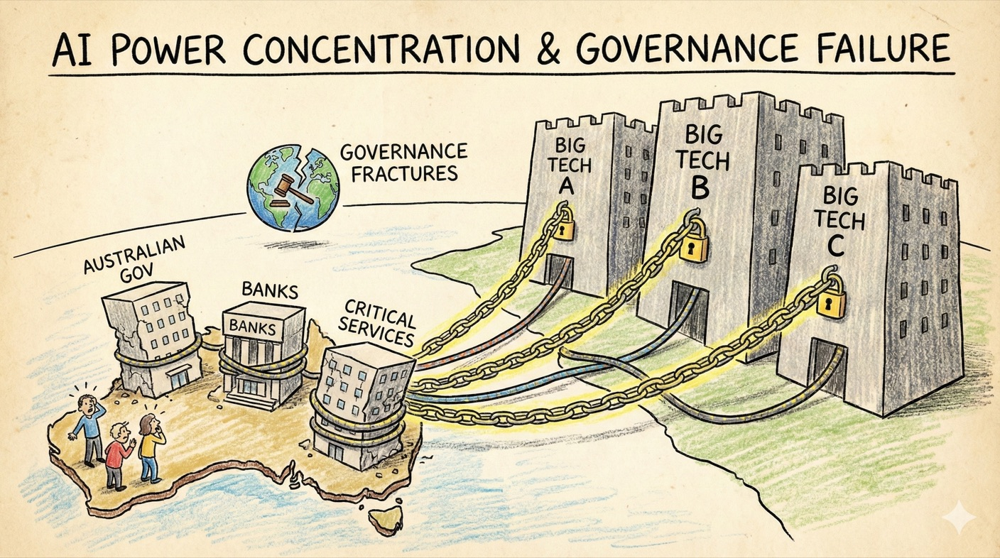

# Scenario 1: AI Power Concentration & Governance Failure

## Summary

**2028-2033:** Three US tech firms come to dominate frontier AI models and infrastructure. By 2031, most Australian government departments rely on one of these providers for document analysis, policy modelling and decision support. The big four banks all licence AI systems from the same two vendors for credit assessment, fraud detection and trading.

Australian universities and research institutions lack the compute and talent to develop competitive alternatives. The National AI Centre coordinates some local capability, but budgets are 1/100th of what leading labs spend on a single training run.

Meanwhile, **international governance coordination fractures.** The US and China compete for AI leadership through subsidies and relaxed oversight. Singapore, UAE and others offer regulatory havens to attract development. The G20 AI Safety Summit produces a non-binding declaration but no enforceable framework.

Australia debates: tighten requirements for AI procurement and risk losing access to cutting-edge systems? Or accept whatever terms providers offer? When a major cloud provider threatens to restrict API access unless Australia softens proposed transparency rules, Canberra backs down. The precedent is set.

**By 2035:** Defence, critical infrastructure, health and social services all depend on a handful of foreign-controlled AI systems. When one provider unilaterally changes terms of service—requiring data to be processed in specific jurisdictions—Australian agencies have no realistic alternative. Contracts are renegotiated under pressure.

When a security researcher discovers that a widely-used AI system has been sending telemetry data to servers in a jurisdiction where intelligence agencies have broad data access, Australian authorities find they lack leverage to demand changes. The system is too embedded to replace quickly and the vendor knows it.

!!! info "Threat pathways"
    This scenario combines three reinforcing pathways:

    **Power concentration** – A few global providers control critical AI capabilities that Australian institutions depend on

    **Governance failure** – International coordination breaks down; regulatory race to the bottom

    **Gradual disempowerment** – Dependencies deepen until Australian institutions lack realistic alternatives or meaningful oversight

---

## What went wrong: C·A·G·R analysis

This scenario shows how governance failures combine with market concentration to create dependencies that are difficult to escape. When both international coordination and domestic sovereignty weaken simultaneously, all four pillars of the framework face severe stress.

=== ":lucide-shield-ban: Containment"

    Limited leverage over what systems get trained or where dangerous capabilities develop. Export controls and compute governance fragment as countries compete. Model weight security weakens as jurisdictions lower standards to attract investment.

=== ":lucide-target: Alignment"

    Safety and values alignment depend on external providers' choices, not Australian standards. Limited local capability to independently evaluate models. Australian law and values may not be reflected in system design.

=== ":lucide-scale: Governance (Primary failure mode)"

    International coordination breaks down—regulatory race to the bottom. Regulatory leverage weakens as services are delivered transnationally. Risk of policy capture: firms become indispensable, threaten withdrawal if regulated. Multilateral agreements fail or prove unenforceable. Australia faces pressure: loosen standards or lose access.

=== ":lucide-shield: Resilience"

    Dependencies on foreign-controlled infrastructure become potential points of failure or leverage. Geopolitical tensions could disrupt access to essential systems. Limited ability to maintain alternatives when markets consolidate.

---

## Questions for actors

Use these questions for risk assessments, strategic planning and tabletop exercises.

=== ":material-bank: Government & Public Institutions"

    - List your three most critical AI dependencies. For each: who provides it? What happens if they change terms? Do you have realistic alternatives?
    - What procurement rules could reduce concentration risk?
    - Which systems should be legally required to be locally controllable or auditable?
    - What safeguards prevent regulatory capture by dominant AI providers?
    - Under what conditions would Australia accept weaker AI safety standards to maintain access to frontier technology?
    - What "red lines" would trigger stronger regulation regardless of economic costs?

=== ":material-briefcase: Business & Industry"

    - Do your contracts include provisions for geopolitical disruption, provider failure or sudden terms changes?
    - Could you continue essential operations for 30 days if your primary AI provider became unavailable?
    - How diversified are your AI dependencies across providers, architectures and jurisdictions?
    - Do your risk assessments and governance processes reflect the strategic nature of these dependencies?

=== ":material-account-group: Communities & Households"

    - Which local services depend on a small number of AI platforms?
    - What forms of local knowledge and capability should be preserved even if AI can do it "better"?
    - What happens to local communities if access to dominant platforms is disrupted?

---

!!! question "Won't market competition solve this? Why does government need to intervene?"

    **Market forces created the concentration—they won't fix it:**

    Training frontier AI requires billions in capital—only a few companies can compete. Platforms with more users attract more developers, creating winner-take-all dynamics. Early capability leads compound as leaders attract talent and capital. Once systems are embedded, switching costs become prohibitive.

    **Why this matters for Australia:**

    We're too small to develop competing frontier capabilities independently. Without intervention, we become dependent on foreign-controlled systems, reducing sovereignty and creating geopolitical vulnerability. Once dependencies deepen, negotiating power disappears.

    **The lesson:** Strategic sectors require active [governance](../framework/governance.md), not just market forces. Power concentration is a policy failure, not an inevitability.

---

## Why this scenario matters for Governance and Resilience

This scenario tests whether Australian institutions can retain meaningful oversight and continuity when critical AI capability is concentrated in a few foreign providers. [Governance](../framework/governance.md) shapes procurement, accountability and negotiating leverage; [Resilience](../framework/resilience.md) asks whether essential functions can continue if a provider withdraws access or changes terms.

---

## Timeline: How governance failure compounds power concentration

**Years 1-3 (underway):**

- A few labs achieve clear capability lead
- Countries begin competing to attract AI investment
- Early multilateral coordination attempts stall
- Australia debates: strengthen regulation or remain competitive?

**Years 4-7:**

- Regulatory fragmentation deepens
- Jurisdictions with weak standards attract development
- Australia faces ultimatums: accept provider terms or lose access
- Critical infrastructure dependencies deepen despite concerns
- International verification and enforcement mechanisms fail to materialise

**Years 8-10:**

- De facto governance by dominant providers
- Attempts at stronger regulation meet credible withdrawal threats
- Australian institutions deeply dependent on systems they cannot oversee
- Alternative providers either consolidated or driven from market
- Public legitimacy of AI governance erodes

---

??? note "Sources & Further Reading"
    This scenario draws from research on tech sovereignty, concentration of AI capabilities and the challenges of international AI governance coordination.

    **Australian context:** [Australian Cyber Security Centre](https://www.cyber.gov.au/) operational guidance · [National AI Centre](https://www.industry.gov.au/science-technology-and-innovation/technology/artificial-intelligence/national-ai-centre) · [List of Critical Technologies in the National Interest](https://www.industry.gov.au/publications/list-critical-technologies-national-interest) (Department of Industry, Science and Resources)

    **Academic and policy research:** Brookings (2024) ["Examining advanced AI capabilities and risks"](https://www.brookings.edu/articles/examining-advanced-ai-capabilities-and-risks/) · Maas (2019) ["How viable is international arms control for military artificial intelligence?"](https://doi.org/10.1080/13523260.2019.1576464) · Bradford (2020) *The Brussels Effect: How the EU Rules the World*

    **Policy organisations:** [OECD AI Policy Observatory](https://oecd.ai/) · [Centre for the Governance of AI](https://www.governance.ai/) · [Carnegie Endowment for International Peace AI & Global Governance Program](https://carnegieendowment.org/programs/technology-and-international-affairs/artificial-intelligence-and-global-governance)

    **Case studies:** US-China semiconductor export controls (2022-2024) · EU AI Act implementation challenges · UK National AI Strategy tensions between innovation and sovereignty

    **Key concepts:** See our [Concepts & Glossary](../concepts.md) for definitions of tech sovereignty, compute governance, regulatory arbitrage and vendor lock-in

---
